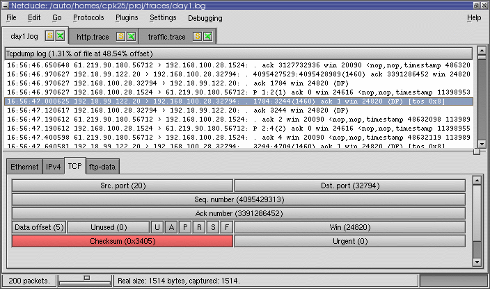

Almost every network research involves trace-based analysis with a captured
stream of packets. This article presents a set of analysis tools which extract
detailed information from [tcpdump/libpcap](http://www.tcpdump.org) traces.

Having a pcap trace in place, it is about to gather futher details from it,
e.g., the traffic peak rate or which protocol accounts for the largest share.
Many tools exist to accomplish this task. Below I will describe three tools
that particularly caught my attention while working with network traffic:
**tcpdstat**, **ipsumdump**, and **Netdude**.

tcpdstat
========

Written by Kenjiro Cho, **tcpdstat** is a powerful  tool that performs an
in-depth protocol breakdown by bytes and packets. It further displays average
and maximum transfer rates, IP flow information, and packet size distribution.
Dave Dittrich applied several
[tcpdstat](http://staff.washington.edu/dittrich/talks/core02/tools/tools.html)
the tool to support a broader range of protocols and services, and to report
more details about flow rates.

Here is an example output (of Dave's enhanced version):

``` none
DumpFile:  trace.pcap
FileSize: 98876.89MB
Id: 200703011241
StartTime: (anonymized)
EndTime:   (anonymized)
TotalTime: 7216.13 seconds
TotalCapSize: 96826.91MB  CapLen: 1514 bytes
# of packets: 134347439 (96826.91MB)
AvgRate: 113.10Mbps  stddev:47.96M   PeakRate: 260.92Mbps

### IP flow (unique src/dst pair) Information ###
# of flows: 1612801  (avg. 83.30 pkts/flow)
Top 10 big flow size (bytes/total in %):
 33.6%  3.2%  2.2%  1.5%  1.4%  1.0%  1.0%  0.9%  0.8%  0.8%

### IP address Information ###
# of IPv4 addresses: 480065
Top 10 bandwidth usage (bytes/total in %):
 34.4% 34.4%  3.3%  3.3%  3.0%  2.7%  2.3%  1.8%  1.5%  1.5%

### Packet Size Distribution (including MAC headers) ###
<<<<
 [   32-   63]:   20839652
 [   64-  127]:   38798140
 [  128-  255]:    3947049
 [  256-  511]:    3746280
 [  512- 1023]:    5675556
 [ 1024- 2047]:   61340762
>>>>

### Protocol Breakdown ###
<<<<
     protocol           packets                 bytes           bytes/pkt
------------------------------------------------------------------------
[0] total        134347439 (100.00%)     101530372750 (100.00%)    755.73
[1] ip           134347439 (100.00%)     101530372750 (100.00%)    755.73
[2]  tcp         118172509 ( 87.96%)      97361936181 ( 95.89%)    823.90
[3]   ftpdata        18640 (  0.01%)         16529412 (  0.02%)    886.77
[3]   ftp            72372 (  0.05%)          4697330 (  0.00%)     64.91
[3]   ssh         13849679 ( 10.31%)      11113777353 ( 10.95%)    802.46
[3]   telnet          9007 (  0.01%)          1526445 (  0.00%)    169.47
[3]   smtp         2133471 (  1.59%)       1447293494 (  1.43%)    678.38
[3]   name              23 (  0.00%)             1426 (  0.00%)     62.00
[3]   dns            35071 (  0.03%)          7071657 (  0.01%)    201.64
[3]   http(s)     25043480 ( 18.64%)      30677552254 ( 30.22%)   1224.97
[3]   http(c)     16165378 ( 12.03%)       2182851897 (  2.15%)    135.03
[3]   kerb5            370 (  0.00%)            30610 (  0.00%)     82.73
[3]   pop3           82382 (  0.06%)         26718043 (  0.03%)    324.32
[3]   sunrpc            30 (  0.00%)             3002 (  0.00%)    100.07
[3]   ident           5107 (  0.00%)           322074 (  0.00%)     63.07
[3]   nntp            1262 (  0.00%)           292679 (  0.00%)    231.92
[3]   epmap         209144 (  0.16%)         12909976 (  0.01%)     61.73
[3]   netb-se       404237 (  0.30%)         47178014 (  0.05%)    116.71
[3]   imap          125983 (  0.09%)        100889454 (  0.10%)    800.82
[3]   bgp              482 (  0.00%)            43139 (  0.00%)     89.50
[3]   ldap            7131 (  0.01%)          1434769 (  0.00%)    201.20
[3]   https        2941177 (  2.19%)       1802114169 (  1.77%)    612.72
[3]   ms-ds         245214 (  0.18%)         24263111 (  0.02%)     98.95
[3]   rtsp         1023246 (  0.76%)        691696863 (  0.68%)    675.98
[3]   ldaps           2828 (  0.00%)           209272 (  0.00%)     74.00
[3]   socks           7883 (  0.01%)          1340672 (  0.00%)    170.07
[3]   kasaa          13348 (  0.01%)          1124944 (  0.00%)     84.28
[3]   mssql-s       309786 (  0.23%)         20411848 (  0.02%)     65.89
[3]   squid          51381 (  0.04%)         14079861 (  0.01%)    274.03
[3]   ms-gc           1865 (  0.00%)           493682 (  0.00%)    264.71
[3]   ms-gcs          2034 (  0.00%)           481178 (  0.00%)    236.57
[3]   hotline            6 (  0.00%)              682 (  0.00%)    113.67
[3]   realaud        19784 (  0.01%)         13197979 (  0.01%)    667.10
[3]   icecast       390203 (  0.29%)        291651836 (  0.29%)    747.44
[3]   gnu6346         6324 (  0.00%)          1048473 (  0.00%)    165.79
[3]   gnu6348          342 (  0.00%)            26047 (  0.00%)     76.16
[3]   gnu6349           14 (  0.00%)             2767 (  0.00%)    197.64
[3]   gnu6350            4 (  0.00%)              732 (  0.00%)    183.00
[3]   irc6666            7 (  0.00%)              434 (  0.00%)     62.00
[3]   irc6667         1379 (  0.00%)           196155 (  0.00%)    142.24
[3]   irc6668            2 (  0.00%)              124 (  0.00%)     62.00
[3]   irc6669            9 (  0.00%)              666 (  0.00%)     74.00
[3]   napster           21 (  0.00%)             1344 (  0.00%)     64.00
[3]   irc7000            7 (  0.00%)              824 (  0.00%)    117.71
[3]   http-a        129807 (  0.10%)         71136838 (  0.07%)    548.02
[3]   other       54862568 ( 40.84%)      48787331392 ( 48.05%)    889.26
[2]  udp          13069221 (  9.73%)       3895596348 (  3.84%)    298.07
[3]   name              18 (  0.00%)             1989 (  0.00%)    110.50
[3]   dns          1799081 (  1.34%)        264263480 (  0.26%)    146.89
[3]   kerb5            100 (  0.00%)            25812 (  0.00%)    258.12
[3]   sunrpc           581 (  0.00%)            57157 (  0.00%)     98.38
[3]   ntp            50387 (  0.04%)          4534933 (  0.00%)     90.00
[3]   epmap             17 (  0.00%)             1824 (  0.00%)    107.29
[3]   netb-ns       148619 (  0.11%)         14736588 (  0.01%)     99.16
[3]   netb-se         1272 (  0.00%)           328673 (  0.00%)    258.39
[3]   ms-ds              8 (  0.00%)              883 (  0.00%)    110.38
[3]   kazaa             29 (  0.00%)             3546 (  0.00%)    122.28
[3]   mssql-s           44 (  0.00%)             3832 (  0.00%)     87.09
[3]   mcast        7216682 (  5.37%)       1943012688 (  1.91%)    269.24
[3]   realaud       459195 (  0.34%)        273532235 (  0.27%)    595.68
[3]   halflif           81 (  0.00%)             5890 (  0.00%)     72.72
[3]   starcra           45 (  0.00%)             6367 (  0.00%)    141.49
[3]   everque            9 (  0.00%)             1351 (  0.00%)    150.11
[3]   unreal          1066 (  0.00%)            93951 (  0.00%)     88.13
[3]   quake             20 (  0.00%)             1860 (  0.00%)     93.00
[3]   other        3384119 (  2.52%)       1394472416 (  1.37%)    412.06
[2]  icmp          3105709 (  2.31%)        272840221 (  0.27%)     87.85
[2]  frag            30903 (  0.02%)         25672129 (  0.03%)    830.73
>>>>
```

At first, tcpdstat shows a summary including the trace size, time, and number
of packets. Most interesting here is the average and peak traffic rate in Mbps
and the standard deviation, measuring how bursty the traffic was. The second
block shows the number of IP flows (i.e., the pair of src and dst address) and
the 10 biggest flows in percent. Next, the total disctinct IP addresses are
displayed along with the top 10 bandwith usage in percent. Unfortunately, only
the percent values are shown and not the addresses themselves. The next block
displays the packet size distribution including MAC headers. The last big block
is the very informative, illustrating a per-packet and per-byte protocol
breakdown. The IP protocol is partitioned in TCP, UDP, ICMP, and fragmented
packets. TCP and UDP packets are further broken down into their application
layer protocols.

Tcpdstat is great to get a bunch of information out of a trace, very easy to
use, but it lacks some flexibility. The tool is your perfect choice if the
above output is enough for you. Otherwise, you might incorporate further tools
into your analysis.

ipsumdump
=========

The [ipsumpdump](http://www.cs.ucla.edu/~kohler/ipsumdump) utility from Eddie
Kohler is the "swiss-army knife" for trace analysis.
It**sum**marizes TCP/**IP dump** files into a nice ASCII format that can be
intuitively understood and easily parsed.

> Ipsumdump can read packets from network interfaces, from tcpdump files, and
> from existing ipsumdump files. It will transparently uncompress tcpdump or
> ipsumdump files when necessary. It can randomly sample traffic, filter
> traffic based on its contents, anonymize IP addresses, and sort packets from
> multiple dumps by timestamp. Also, it can optionally create a tcpdump file
> containing actual packet data.

To demonstrate its versatility, I provided the output of `ipsumdump-h` below:

``` none
'Ipsumdump' reads IP packets from tcpdump(1) files, or network interfaces,
and summarizes their contents in an ASCII log.

Usage: ipsumdump [CONTENT OPTIONS] [-i DEVNAMES | FILES] > LOGFILE

Options that determine summary dump contents (can give multiple options):
  -t, --timestamp            Include packet timestamps.
  -T, --first-timestamp      Include flow-begin timestamps.
  -s, --src                  Include IP source addresses.
  -d, --dst                  Include IP destination addresses.
  -S, --sport                Include TCP/UDP source ports.
  -D, --dport                Include TCP/UDP destination ports.
  -l, --length               Include IP lengths.
  -p, --protocol             Include IP protocols.
      --id                   Include IP IDs.
  -g, --fragment             Include IP fragment flags ('F' or '.').
  -G, --fragment-offset      Include IP fragment offsets.
      --ip-sum               Include IP checksums.
      --ip-opt               Include IP options.
  -F, --tcp-flags            Include TCP flags word.
  -Q, --tcp-seq              Include TCP sequence numbers.
  -K, --tcp-ack              Include TCP acknowledgement numbers.
  -W, --tcp-window           Include TCP receive window (unscaled).
  -O, --tcp-opt              Include TCP options.
      --tcp-sack             Include TCP selective acknowledgement options.
      --udp-length           Include UDP lengths.
  -L, --payload-length       Include payload lengths (no IP/UDP/TCP headers).
      --payload              Include packet payloads as quoted strings.
      --payload-md5          Include MD5 checksum of packet payloads.
      --capture-length       Include lengths of captured IP data.
  -c, --packet-count         Include packet counts (usually 1).
      --link                 Include link numbers (NLANR/NetFlow).

Data source options (give exactly one):
  -r, --tcpdump              Read tcpdump(1) FILES (default).
  -i, --interface            Read network devices DEVNAMES until interrupted.
      --ipsumdump            Read existing ipsumdump FILES.
      --format FORMAT        Read ipsumdump FILES with format FORMAT.
      --dag[=ENCAP]          Read DAG-format FILES.
      --nlanr                Read NLANR-format FILES (fr/fr+/tsh).
      --netflow-summary      Read summarized NetFlow FILES.
      --tcpdump-text         Read tcpdump(1) text output FILES.

Other options:
  -o, --output FILE          Write summary dump to FILE (default stdout).
  -b, --binary               Create binary output file.
  -w, --write-tcpdump FILE   Also dump packets to FILE in tcpdump(1) format.
  -f, --filter FILTER        Apply tcpdump(1) filter FILTER to data.
  -A, --anonymize            Anonymize IP addresses (preserves prefix & class).
      --no-promiscuous       Do not put interfaces into promiscuous mode.
      --bad-packets          Print '!bad' messages for bad headers.
      --sample PROB          Sample packets with PROB probability.
      --multipacket          Produce multiple entries for a flow identifier
                             representing multiple packets (NetFlow only).
      --collate              Collate packets from data sources by timestamp.
      --interval TIME        Stop after TIME has elapsed in trace time.
      --limit-packets N      Stop after processing N packets.
      --map-address ADDRS    When done, print to stderr the anonymized IP
                             addresses and/or prefixes corresponding to ADDRS.
      --record-counts TIME   Record packet counts every TIME seconds in output.
      --random-seed SEED     Set random seed to SEED (default is random).
      --no-mmap              Don't memory-map input files.
  -q, --quiet                Do not print progress bar.
      --config               Output Click configuration and exit.
  -V, --verbose              Report errors verbosely.
  -h, --help                 Print this message and exit.
  -v, --version              Print version number and exit.

Report bugs to <kohler@cs.ucla.edu>.
```

Among the above options, some deserve more attention. For example, the
`--payload-md5` option includes a MD5 checksum (e.g. i4CxGSojVHB2XcZw97ZpQb)
of the packet payload in the dump. This option comes in handy when you want to
check for packet duplicates. Another nifty option is `--anonymize`.  Since
traces can contain sensitive data, it is possible to anonymize the IP addresses
in the output in order to prevent information leakage. The anonymization
preserves prefix and class. In high-volume networks, the
`--sample=p` option might be interesting. It samples packets with probability
*p*. That is, *p* is the chance that a packet will cause output to be
generated. The actual probability may differ from the specified probability,
due to fixed point arithmetic. If you want to merge several trace files
retaining the temporal order, `--collate` together with `--write-tcpdump` sorts
your packets with increasing timestamp.

Summing up, ipsumdump is a flexible trace analysis tool complementing tcpdump.
However, it does not feature predefined evaluation methods like
tcpdstat (which is actually not a design goal).  Nevertheless,
ipsumdump is a valuable tool to quickly generate easily readable ASCII output
or to obtain well-formatted output for subsequent processing/scripting. It
unveils its real power when used for trace manipulation such as merging,
modifying, or anonymizing tcpdump traces.

Netdude
=======

[Netdude](http://netdude.sourceforge.net) (**Net**work **du**mp data
**d**isplayer and **e**ditor) is a graphical tool to edit tcpdump trace files,
written by [Christian Kreibich](http://www.icir.org/christian). In fact, it is
a front-end to the [libnetdude](http://netdude.sourceforge.net/doco/libnetdude)
packet manipulation library. Since complex trace manipulation is non-trivial
and often requires custom coding, Netdude provides a GUI enabling users to

- edit traces of arbitrary size in a scalable fashion. Netdude never loads
  more than a configurable maximum number of packets into memory at any time.
- edit multiple traces at the same time, making it easy to move packets from
  one trace to a different one.
- Modify every field in protocol headers for which a protocol plugin provides
  support. These modifications can be applied to either only individually
  selected packets, packets currently in memory, or all packets in the trace,
  including the ones not currently loaded.
- Filter packets by using filter plugins. Netdude 0.4.6 ships with a BPF filter
  plugin that allows you to use the standard BPF filter language to define
  your filters.
- Inspect and edit raw packet content using Netdude's payload editor in
  either hex or ASCII mode whichever is more convenient for the payload you are
  editing.
- Move packets around, duplicate them, remove them from traces.
- See the tcpdump output updating instantly according to the modifications
  you're making.
- Conveniently use the clipboard to select lines from the tcpdump output for
  situations when you need the tcpdump output only (e.g., when writing
  documentation, papers or emails).

As soon as packet editing is part of the game, Netdude offers an interactive
and user-friendly GUI to perform even sophisticated manipulations. The
screenshot below illustrates how one can graphically manipulate the TCP header
fields.

{:.float-center .shadow}

Conclusion
==========

Nowadays, captured network traffic is mostly available as a tcpdump/libpcap
trace. In this article, I introduce three tools enabling in-depth trace
examination. At first, the tool tcpdstat provides a high-level view of the
trace ingredients with a detailed protocol breakdown. Second, ipsumdump offers
a flexible means to generate nicely formatted ASCII dump. It can be used to
quickly extract a desired piece of information or as a multi-purpose output
generator. Finally, Netdude features a comfortable GUI to selectively
manipulate packet details. Equipped with this arsenal, trace-based network
analysis feels like a hot knife through butter.
