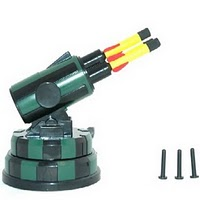
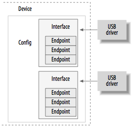
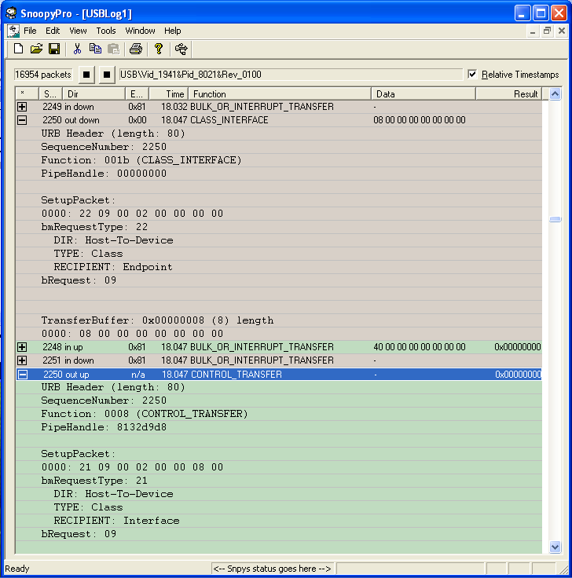
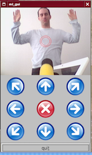

This article explains the creation process of a Linux kernel device driver for
an undocumented USB device. After having reverse-engineered the USB
communication protocol, I present the architecture of the USB device driver. In
addition to the kernel driver I introduce a simple user-space tool that can be
used to control the device. Although I have to delve into the specifics of a
particular device, the process can be applied to other USB devices as well.

Introduction
============


{:.float-right .margin-left-1}
Recently, I found a fancy device while searching eBay: the [DreamCheeky USB
missile launcher](http://www.dreamcheeky.com).  The manufacturer neither
provides a Linux driver nor publishes the USB protocol specification. Only a
binary Windows driver is available, turning the missile launcher into complete
"black-box" for Linux users. What a challenge! Let's get the damn gadget
working under Linux.

To facilitate USB programming, the USB interface is accessible from user-space
with [libusb](http://libusb.sourceforge.net), a programming API concealing
low-level kernel interaction. The proper way to write a device driver for the
missile launcher would hence be to leverage this API and ignore any kernel
specifics. Nevertheless, I wanted to get involved with kernel programming and
decided thus to write a kernel module despite the increased complexity and
higher effort.

The remainder of this article is structured as follows. After pointing to some
related work, I give a quick USB overview. Thereafter, I present the
reverse-engineering process to gather the unknown USB commands steering the
missile launcher. To come up with a full-featured kernel device driver, I
describe the kernel module architecture which incorporates the derived control
commands. Finally, I demonstrate a simple tool in user-space that makes use of
the driver.

Related Work
============

Apparently I have not been the only one who played with this gadget. However,
none of the existing approaches I have encountered pursue the creation of a
Linux device driver for the *kernel*. [The Launcher
Library](http://kim.tensta.gannert.se/projects/launcher) provides a user-space
library based on libusb. [AHmissile](http://fatal.se/fulhack/ahmissile) is a
GTK+ control tool; a ncurses application is
[available](http://www.amctrl.com/rocketlauncher.html), too.
Apple users get happy with the [USB missile launcher
NZ](http://dgwilson.wordpress.com) project. Moreover, the python implementation
[pymissile][pymissile] supports a missile
launcher of a different manufacturer. The author combined the missile
launcher with a webcam in order to to create an automated sentry guard reacting
on motion. I will return to these funky ideas later.

USB Primer
==========

The universal serial bus (USB) connects a host computer with numerous
peripheral devices. It was designed to unify a wide range of slow and old buses
(parallel, serial, and keyboard connections) into a single bus type. It is
topologically not constructed as a bus, but rather as a tree of several
point-to-point links. The USB host controller periodically polls each device if
it has data to send. With this design, no device can send before it has not been
asked to do so, resulting in a plug-and-play-friendly architecture.

{:.float-right .margin-left-1}
Linux supports two main types of drivers: host and device drivers. Let's ignore
the host component and have a deeper look at the USB device. As shown on the
right side, a USB *device* consists of one or more *configurations*
which in turn have one ore more *interfaces*.  These interfaces contain zero or
more *endpoints* which make up the basic form of USB communication. An endpoint
is always uni-directional, either from the host to the device (*OUT* endpoint)
or from the device to the host (*IN* endpoint). There are four types of
endpoints and each transmits data in a different way:

- Control
- Interrupt
- Bulk
- Isochronous

*Control endpoints* are generally used to control the USB device
asynchronously, i.e. sending commands to it or retrieving status information
about it. Every device possesses a control "endpoint 0" which is used by the USB
core to initialize the device. *Interrupt endpoints* occur periodically
and transfer small fixed-size data portions every time when the USB host asks
the device. They are commonly used by mice and keyboards as primary transport
method. As *bulk* and *isochronous endpoints* are not relevant for
our missile launcher, I skip their discussion. An excellent introduction from a
programming perspective gives the [Linux Device
Drivers](http://lwn.net/Kernel/LDD3) book. Below is
some output from `lsusb -v` providing detailed information about the missile
launcher.

``` none
Bus 005 Device 004: ID 1941:8021
Device Descriptor:
  bLength                18
  bDescriptorType         1
  bcdUSB               1.10
  bDeviceClass            0 (Defined at Interface level)
  bDeviceSubClass         0
  bDeviceProtocol         0
  bMaxPacketSize0         8
  idVendor           0x1941
  idProduct          0x8021
  bcdDevice            1.00
  iManufacturer           0
  iProduct                0
  iSerial                 0
  bNumConfigurations      1
  Configuration Descriptor:
    bLength                 9
    bDescriptorType         2
    wTotalLength           34
    bNumInterfaces          1
    bConfigurationValue     1
    iConfiguration          0
    bmAttributes         0xa0
      Remote Wakeup
    MaxPower              100mA
    Interface Descriptor:
      bLength                 9
      bDescriptorType         4
      bInterfaceNumber        0
      bAlternateSetting       0
      bNumEndpoints           1
      bInterfaceClass         3 Human Interface Devices
      bInterfaceSubClass      0 No Subclass
      bInterfaceProtocol      0 None
      iInterface              0
        HID Device Descriptor:
          bLength                 9
          bDescriptorType        33
          bcdHID               1.00
          bCountryCode            0 Not supported
          bNumDescriptors         1
          bDescriptorType        34 Report
          wDescriptorLength      52
         Report Descriptors:
           ** UNAVAILABLE **
      Endpoint Descriptor:
        bLength                 7
        bDescriptorType         5
        bEndpointAddress     0x81  EP 1 IN
        bmAttributes            3
          Transfer Type            Interrupt
          Synch Type               None
          Usage Type               Data
        wMaxPacketSize     0x0008  1x 8 bytes
        bInterval              10
```

The output is structured and indented like a typical USB device. First, vendor
and product ID uniquely identify this USB gadget. These IDs are used by the USB
core to decide which driver to give a device to. Moreover, hotplug scripts can
decide which driver to load when a particular device is plugged in. Next, we
can read off the maximum power usage (100 mA) in the configuration section. The
subordinate interface contains apparently one interrupt IN endpoint (besides
the control endpoint 0) that can be accessed at address `0x81`. Because it is
an IN endpoint, it returns status information from the device. To handle the
incoming data we first need to understand the missile launcher control
protocol.

Reverse-Engineering the USB Protocol
====================================

The first step involves reverse-engineering (or "snooping") the USB
communication protocol spoken by the binary Windows driver. One approach would
be to consign the device in a VMware and capture the exchanged data on the host
system. But since several tools to analyze USB traffic already exist, the easier
solution is to rely on one of those. The most popular free application appears
to be [SnoopyPro](http://sourceforge.net/projects/usbsnoop).  Surprisingly I do
not have Windows box at hand, so I had to install the binary driver together
with SnoopyPro in a VMware.

In order to capture all relevant USB data and intercept all device control
commands, the missile launcher has to perform every possible action while being
monitored: moving the two axes alone and together, shooting, and moving to the
limiting axes boundaries (which will trigger a notification that the axes
cannot be moved further in one direction). While analyzing the [SnoopyPro
dump](/dump/snoopy-pro.xml), one can easily discover the control commands sent
to the missile launcher. As an example, the Figure below shows an 8 byte
transfer buffer.  When moving the missile launcher to the right, the buffer
holds `0x00000008`. Moving the launcher up changes the buffer contents to
`0x00000001`. It is apparently very easy to deduce the control bytes used to
control the missile launcher. Unless a "stop" command (`0x00000000`) is sent to
the device, it keeps the state of the last command.  This means if the "down"
command is issued, the device continues to turn until it receives a new
command. If it is not possible to move further, the motor keeps up running and
the gears crack with a unbearable painful sound.  Upon closer examination, the
interrupt IN endpoint buffer varies depending on the current device position.
Whensoever an axis reaches its boundary (and creates the maddening sound), the
device detects it and changes the interrupt buffer contents accordingly. This
means of notification can be leveraged by the kernel developer to implement a
boundary checking mechanism sending a stop command as soon as the missile
launcher runs against a wall.

{:.float-center .shadow}

Here is an excerpt of the driver source showing the complete list of control
commands that can be sent to the device.

``` c
#define ML_STOP         0x00
#define ML_UP           0x01
#define ML_DOWN         0x02
#define ML_LEFT         0x04
#define ML_RIGHT        0x08
#define ML_UP_LEFT      (ML_UP | ML_LEFT)
#define ML_DOWN_LEFT    (ML_DOWN | ML_LEFT)
#define ML_UP_RIGHT     (ML_UP | ML_RIGHT)
#define ML_DOWN_RIGHT   (ML_DOWN | ML_RIGHT)
#define ML_FIRE         0x10
```

The following bytes appear in the buffer of the interrupt IN endpoint (shown as
comment) and indicate that a boundary has been reached.

``` c
#define ML_MAX_UP       0x80        /* 80 00 00 00 00 00 00 00 */
#define ML_MAX_DOWN     0x40        /* 40 00 00 00 00 00 00 00 */
#define ML_MAX_LEFT     0x04        /* 00 04 00 00 00 00 00 00 */
#define ML_MAX_RIGHT    0x08        /* 00 08 00 00 00 00 00 00 */
```

With all required control information in place, let's now adopt the programmer's
perspective and delve into the land of kernel programming.

The Device Driver
=================

Writing code for the kernel is an art by itself and I will only touch the tip of
the iceberg. To get a deeper understanding I recommend the books [Linux Device
Drivers](http://lwn.net/Kernel/LDD3) and [Understanding the Linux
Kernel](http://www.oreilly.com/catalog/understandlk).

As for many other disciplines the separation of *mechanism* and *policy* is a
fundamental paradigm a programmer should follow. The mechanism provides the
capabilities whereas the policy expresses rules how to use those capabilities.
Different environments generally access the hardware in different ways. It is
hence imperative to write *policy-neutral* code: a driver should make the
hardware available without imposing constraints.

A nice feature of Linux is the ability to dynamically link object code to the
running kernel. That piece of object code is called a kernel *module*.
Linux distinguishes between three basic device types that a module can
implement:

- Character devices
- Block devices
- Network interfaces

A *Character (char) device* transfers a stream of bytes from and to the
user process. The module therefore implements system calls such as
*open*, *close*, *read*, *write* and *ioctl*.
A char device looks like a file, except that file is "seekable" and most devices
operate sequentially. Examples for char devices are the text console
(`/dev/console`) and serial ports (`/dev/ttyS0`). Most simple
hardware devices are driven by char drivers. Discussing *block devices*
and *network interfaces* goes beyond the scope of this article, please
refer to the specified literature for details.

Besides this classification, other orthogonal ways exist. As an example, USB
devices are implemented as USB modules but can show up as char devices (like
our missile launcher), block devices (USB sticks, say), or network interfaces
(a USB Ethernet interface). Let us now look at the rough structure of a USB
kernel module and then turn to particularities of the missile launcher.


``` c
struct usb_ml {
    /* One structure for each connected device */
};

static struct usb_device_id ml_table [] = {
    { USB_DEVICE(ML_VENDOR_ID, ML_PRODUCT_ID) },
    { }
};

static int ml_open(struct inode *inode, struct file *file)
{
    /* open syscall */
}
static int ml_release(struct inode *inode, struct file *file)
{
    /* close syscall */
}

static ssize_t ml_write(struct file *file, const char __user *user_buf, size_t
        count, loff_t *ppos);
{
    /* write syscall */
}

static struct file_operations ml_fops = {
    .owner =    THIS_MODULE,
    .write =    ml_write,
    .open =     ml_open,
    .release =  ml_release,
};

static int ml_probe(struct usb_interface *interface, const struct usb_device_id
        *id)
{
    /* called when a USB device is connected to the computer. */
}

static void ml_disconnect(struct usb_interface *interface)
{
    /* called when unplugging a USB device. */
}

static struct usb_driver ml_driver = {
    .name = "missile_launcher",
    .id_table = ml_table,
    .probe = ml_probe,
    .disconnect = ml_disconnect,
};

static int __init usb_ml_init(void)
{
    /* called on module loading */
}

static void __exit usb_ml_exit(void)
{
    /* called on module unloading */
}

module_init(usb_ml_init);
module_exit(usb_ml_exit);
```

Apart from some global variables, helper functions, and interrupt handlers,
this is already the entire kernel module! But let's start off step by step. The
USB driver is represented by a `struct usb_driver` containing some function
callbacks and variables identifying the USB driver. When the module is loaded
via the *insmod* program, the `__init usb_ml_init(void)` function is executed
which registers the driver with the USB subsystem. When the module is unloaded,
`__exit usb_ml_exit(void)` is called which deregisters the driver from the USB
subsystem. The `__init` and `__exit` tokens indicate that these functions are
only called at initialization and exit time. Having loaded the module, the
*probe* and *disconnect* function callbacks are set up. In the probe function
callback, which is called when the device is being plugged in, the driver
initializes any local data structures used to manage the USB device. For
example, it allocates memory for the `struct usb_ml` which contains run-time
status information about the connected device. Here is an excerpt from the
beginning of the function:


``` c
static int ml_probe(struct usb_interface *interface,
                    const struct usb_device_id *id)
{
    struct usb_device *udev = interface_to_usbdev(interface);
    struct usb_ml *dev = NULL;
    struct usb_host_interface *iface_desc;
    struct usb_endpoint_descriptor *endpoint;
    int i, int_end_size;
    int retval = -ENODEV;

    if (! udev)
    {
        DBG_ERR("udev is NULL");
        goto exit;
    }

    dev = kzalloc(sizeof(struct usb_ml), GFP_KERNEL);
    if (! dev)
    {
        DBG_ERR("cannot allocate memory for struct usb_ml");
        retval = -ENOMEM;
        goto exit;
    }

    dev->command = ML_STOP;

    init_MUTEX(&dev->sem);
    spin_lock_init(&dev->cmd_spinlock);

    dev->udev = udev;
    dev->interface = interface;
    iface_desc = interface->cur_altsetting;

    /* Set up interrupt endpoint information. */
    for (i = 0; i < iface_desc->desc.bNumEndpoints; ++i)
    {
        endpoint = &iface_desc->endpoint[i].desc;

        if (((endpoint->bEndpointAddress & USB_ENDPOINT_DIR_MASK) == USB_DIR_IN)
                && ((endpoint->bmAttributes & USB_ENDPOINT_XFERTYPE_MASK) ==
                    USB_ENDPOINT_XFER_INT))
            dev->int_in_endpoint = endpoint;

    }
    if (! dev->int_in_endpoint)
    {
        DBG_ERR("could not find interrupt in endpoint");
        goto error;
    }

    /* ... */

    /* We can register the device now, as it is ready. */
    retval = usb_register_dev(interface, &ml_class);

    /* ... */
}
```


You might have noted the use of `goto` statements in this code snippet. While
`goto` statements are generally [considered
harmful](http://www.acm.org/classics/oct95), kernel programmers, however,
employ `goto` statements to bundle error handling at a central place,
eliminating complex, highly-indented logic. The probe function allocates memory
for the internal device structure, initializes semaphores and spin-locks, and
sets up endpoint information.  Somewhat later in the function, the device is
being registered. The device is now ready to be accessed from user space via
system calls. I will discuss the simple user-space tool accessing the missile
launcher shortly. Yet before that, I present the communication primitives used
to send data to the device.

The Linux USB implementation uses a *USB request block* (URB) as "data
carrier" to communicate with USB devices. URBs are like data messages that are
sent asynchronously from and to endpoints. Remember that the USB standard
includes four types of endpoints. Likewise, four different types of URBs exist,
namely control, interrupt, bulk, and isochronous URBs. Once an URB has been
allocated and initialized by the driver, it is be submitted to the USB core
which forwards it to the device. If the URB was successfully delivered to the
USB core, a *completion handler* is executed. Then the USB core returns
control to the device driver.

As our missile launcher features two endpoints (endpoint 0 and the interrupt
endpoint), we have to deal with both control and interrupt URBs. The
reverse-engineered commands are basically packed into an control URB and then
sent out to the device. Also, we continuously receive status information from
the periodic interrupt URBs. For example, to send simple data to the missile
launcher, the function `usb_control_msg` is used:

``` c
memset(&buf, 0, sizeof(buf));
buf[0] = cmd;

/* The interrupt-in-endpoint handler also modifies dev->command. */
spin_lock(&dev->cmd_spinlock);
dev->command = cmd;
spin_unlock(&dev->cmd_spinlock);

retval = usb_control_msg(dev->udev,
        usb_sndctrlpipe(dev->udev, 0),
        ML_CTRL_REQUEST,
        ML_CTRL_REQEUST_TYPE,
        ML_CTRL_VALUE,
        ML_CTRL_INDEX,
        &buf,
        sizeof(buf),
        HZ * 5);

if (retval < 0)
{
    DBG_ERR("usb_control_msg failed (%d)", retval);
    goto unlock_exit;
}
```

The command `cmd` is inserted into the buffer `buf`
containing the data to be sent to the device. If the URB completes successfully,
the corresponding handler is executed. It performs nothing fancy, except telling
the driver that we launched a (yet uncorrected) command via the *write*
syscall:

``` c
static void ml_ctrl_callback(struct urb *urb, struct pt_regs *regs)
{
    struct usb_ml *dev = urb->context;
    dev->correction_required = 0;
}
```

We do not want the missile launcher hardware to be damaged by neither sending
improper commands nor sending any commands when it reached an axis boundary.
Ideally, whenever an axis boundary is reached (meaning that the missile launcher
cannot turn further in one direction), the device should stop the movement in
the particular direction. The completion handler of the interrupt URB turns out
to be the right place to implement this idea:

``` c
static void ml_int_in_callback(struct urb *urb, struct pt_regs *regs)
{
        /* ... */

        if (dev->int_in_buffer[0] & ML_MAX_UP && dev->command & ML_UP)
        {
            dev->command &= ~ML_UP;
            dev->correction_required = 1;
        } else if (dev->int_in_buffer[0] & ML_MAX_DOWN &&
                dev->command & ML_DOWN)
        {
            dev->command &= ~ML_DOWN;
            dev->correction_required = 1;
        }

        if (dev->int_in_buffer[1] & ML_MAX_LEFT && dev->command & ML_LEFT)
        {
            dev->command &= ~ML_LEFT;
            dev->correction_required = 1;
        } else if (dev->int_in_buffer[1] & ML_MAX_RIGHT &&
                dev->command & ML_RIGHT)
        {
            dev->command &= ~ML_RIGHT;
            dev->correction_required = 1;
        }

        /* ... */
}
```

The above code is used to set the `correction_required` variable which triggers
a "correction" control URB: this URB contains simply the last command without
the harming bit. Remember that the URB callback functions run in *interrupt
context* and thus should not perform any memory allocations, hold semaphores,
or cause anything putting the process to sleep. With this automatic correction
mechanism, the missile launcher is shielded from improper use. Again, it does
not impose policy constraints, it protects only the device.

User-Space Control
==================

For most folks fun starts in here. One doesn't kick the bucket when
dereferencing NULL-pointers and the good old libc is available, too. After
having loaded the kernel module, the missile launcher is accessible via
`/dev/ml0`. A second missile launcher would show up as `/dev/ml1` and so on.
Here is a very simple application to control the device:


``` c
#include <fcntl.h
#include <stdio.h
#include <stdlib.h
#include <unistd.h

#define DEFAULT_DEVICE      "/dev/ml0"
#define DEFAULT_DURATION    800

#define ML_STOP         0x00
#define ML_UP           0x01
#define ML_DOWN         0x02
#define ML_LEFT         0x04
#define ML_RIGHT        0x08
#define ML_FIRE         0x10

#define ML_FIRE_DELAY   5000

void send_cmd(int fd, int cmd)
{
    int retval = 0;

    retval = write(fd, &cmd, 1);
    if (retval < 0)
        fprintf(stderr, "an error occured: %d\n", retval);
}

static void usage(char *name)
{
    fprintf(stderr,
            "\nusage: %s [-mslrudfh] [-t msecs]\n\n"
            "  -m      missile launcher [/dev/ml0]\n"
            "  -s      stop\n"
            "  -l      turn left\n"
            "  -r      turn right\n"
            "  -u      turn up\n"
            "  -d      turn down\n"
            "  -f      fire\n"
            "  -t      specify duration in milli seconds\n"
            "  -h      display this help\n\n"
            "notes:\n"
            "* it is possible to combine the directions of the two axes, e.g.\n"
            "  '-lu' send_cmds the missile launcher up and left at the same time.\n"
            "" , name);
    exit(1);
}

int main(int argc, char *argv[])
{
    char c;
    int fd;
    int cmd = ML_STOP;
    int duration = DEFAULT_DURATION;
    char *dev = DEFAULT_DEVICE;

    if (argc < 2)
        usage(argv[0]);

    while ((c = getopt(argc, argv, "mslrudfht:")) != -1)
    {
        switch (c)
        {
            case 'm': dev = optarg;
                      break;
            case 'l': cmd |= ML_LEFT;
                      break;
            case 'r': cmd |= ML_RIGHT;
                      break;
            case 'u': cmd |= ML_UP;
                      break;
            case 'd': cmd |= ML_DOWN;
                      break;
            case 'f': cmd = ML_FIRE;
                      break;
            case 's': cmd = ML_STOP;
                      break;
            case 't': duration = atoi(optarg);
                      break;
            default: usage(argv[0]);
        }
    }

    fd = open(dev, O_RDWR);
    if (fd == -1)
    {
        perror("open");
        exit(1);
    }

    send_cmd(fd, cmd);

    if (cmd & ML_FIRE)
        duration = ML_FIRE_DELAY;
    else if (cmd == ML_UP || cmd == ML_DOWN)
        duration /= 2;
    usleep(duration * 1000);

    send_cmd(fd, ML_STOP);

    close(fd);

    return EXIT_SUCCESS;
}
```

This tool, let's name it `ml_control`, allows the user to send data to the
device via the *write* syscall. For example, the device moves three seconds up
and left with `./ml_control -ul -t 3000`, shoots with `./ml_control -f`, or
stop with `./ml_control -s`.  Consider the code as proof of concept, of course
more sophisticated applications are imaginable.

{:.float-right .margin-left-1}
Just for fun, I mounted an external iSight camera on top of the missile
launcher. Like the author of [pymissile][pymissile] suggests, creating an
automated sentry based on motion detection is a funky next step. Whenever a
movement in the current view is detected, the missile launcher should
automatically align itself and fire a missile. Due to the lack of time, I could
not pursue this project. Maybe someday, in the unlikely event of getting bored,
I will return to this idea.  Nevertheless, my friend Thorsten Röder quickly
hacked together a Qt GUI. It somehow resembles an early version of Quake...

Summary
=======

In this article, I frame the creation of a USB device driver for the Linux
kernel. At first I reverse-engineer the unknown USB protocol by intercepting
all USB traffic to and from the device with the Windows driver. Having captured
the complete communication primitives, I explain how to build a USB kernel
driver. Finally, a proof-of-conecpt user-space tool is presented that lays the
foundation stone for further fancy ideas. Future work touches topics like
augmenting the missile launcher with a video camera or mounting it on arbitrary
devices. The code from this article and a full implementation of the device
driver is available at my [github repository][ml-driver].

[pymissile]: http://scott.weston.id.au/software/pymissile
[ml-driver]: https://github.com/mavam/ml-driver
