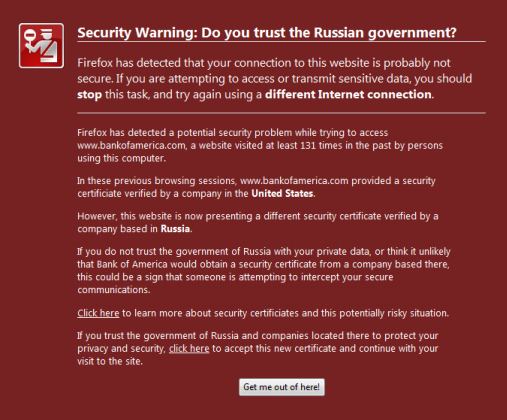

Is your SSL secure? I'm not sure that the answer is quite so binary after
reading the paper [Certified Lies: Detecting and Defeating Government
Interception Attacks Against SSL][Soghoian10] by [Christopher
Soghoian](http://www.dubfire.net) and [Side Stamm](http://www.sidstamm.com). In
a so-called *compelled certificate creation attack*, a government agency forces
a CA to issue a fake certificate to intercept an SSL-encrypted (or more
precisly: TLS-encrypted) session without triggering a warning in the victim's
browser. This works seamlessly, because it does not matter who issued a
specific certificate as long as the browser sees a valid chain of trust
terminated with a known root certificate. Although the authors claim that this
attack is exercised in practice, data-driven evidence is yet lacking.

## Proactive Protection

In order to assess whether or not one's current TLS session is being
intercepted, the authors have developed a Firefox extension called CertLock,
which extends the browser history by collecting additional certificate
information such as its hash, the name and country of the issuing CA and the
website, and the trust chain up to the root CA. Each time the user revisits a
TLS-protected site for which a certificate in the history exists, CertLock
compares their two hash values. If a mismatch is detected, CertLock next
compares the issuing CAs' country. In the event that they differ, CertLock
presents a warning to the user; otherwise the page loads without any warnings.

Although CertLock alleviates some problems with the compelled certificate
creation attack, it is still limited in the following ways.

### Trust-On-First-Use

When visiting a TLS-protected website for the first time, the user immediately
faces a dilemma: how to trust the certificate chain when there is nothing to
compare to. Because CertLock operates by comparing the current certificate with
one from the history, it cannot detect if the first encountered certificate
chain is authentic. That is, CertLock can only protect the user for sites that
have already been visited in the past *and* deemed secure.

When planning a trip to a potentially hostile environment (e.g., [DEF
CON](http://www.wallofsheep.com) or China), a common [recommendation][nick
laptop] is to use a fresh laptop, or at least to replace the laptop's harddrive
and start over with a fresh system installation. This is precisly the scenario
where CertLock would be necessary, but cannot function due to the lack of
browsing history.

### Ground Truth

A well-known issue with anomaly detection is the presence of an
adversary during the training phase, who can later conduct unnoticed attacks
when the system is in live operation. CertLock cannot distinguish counterfeit
from real certificate trust chains when trained maliciously. In fact, the
opposite of the intended behavior may occur: a benign certificate may be
misclassified as untrustworthy, and a forged certificate may be blindly
accepted. This problem highlights the need for a trustworthy past certificate
history, otherwise it is impossible to make an accurate decision.

### False Negatives

CertLock suffers from false negatives when *(i)* the actual and compelled CAs
are from the same country and *(ii)* the certificate differs from the one in
the history but the issuing CA has not changed. At the same time, the number of
false positives is greatly reduced this way, which is vital to get the user's
attention in this scenario.

### User Failure

When I asked two of my friends what their impression was of CertLock's displayed
warning, I was surprised to hear "it looks like spam - what does Russia have to
do with the site I am visiting?"

{:.float-center .shaded}

Granted, the authors acknowledge the room for
improvement on the user interface, and their intention to brush up the warning's
design. However, given the population's
[limited](http://www.youtube.com/watch?v=uEP7uti0PDw)
[geographic](http://www.youtube.com/watch?v=NAWe7Xk5e4A)
[understanding](http://www.youtube.com/watch?v=lj3iNxZ8Dww)
of international relations, this may be a challenging task.


## Retrospective Analysis

In addition to the aspects above which highlight the need for better proactive
defenses, opportunities for forensic analysis are equally important to
appreciate. Network traffic traces may contain evidence of the compelled
certificate creation attack. [Bro](http://www.bro-ids.org) already supports
[extraction of certificates][Bejtlich09] which minimizes the programmatic
efforts required to implement a detector. To address the problem of ground
truth, the traces should ideally span long time frames and be recorded from
multiple vantage points. In the future, I plan to write a Bro script to detect
this type of TLS tampering, which could be particularly useful to unveil
targeted attacks, as these tend to live under the radar of the standard network
intrusion detection system.

**Update** (*March 3, 2011*):
It is great to see some momentum in the community regarding this topic. Erik
Hjelmvik blogs about the [forensic analysis of TLS certificates][Hjelmvik11] to
detect man-in-the-middle attacks.  To extract certifcate files, he suggests
NetworkMiner, a GUI tool for Windows.

Well, Bro's TLS analyzer also provides this basic extraction functionality, yet
more beyond that. For example, here's a subset of events the TLS analyzer
generates:

``` bro
ssl_conn_weak(name: string, c: connection);
ssl_certificate_seen(c: connection, is_server: bool);
ssl_certificate(c: connection, cert: X509, is_server: bool);
ssl_conn_attempt(c: connection, version: count, ciphers: cipher_suites_list);
ssl_conn_server_reply(c: connection, version: count, ciphers: cipher_suites_list);
ssl_conn_established(c: connection, version: count, cipher_suite: count);
process_X509_extensions(c: connection, ex: X509_extension);
ssl_session_insertion(c: connection, id: SSL_sessionID);
ssl_conn_reused(c: connection, session_id: SSL_sessionID);
ssl_X509_error(c: connection, err: int, err_string: string);
```

Each time Bro raises one of these events, user-defined handler code executes.
This allows for a very fine-grained analysis of TLS traffic and certificates.
Such a high-level abstraction of activity exists for a numerous network
protocols, which makes Bro "the Python/Ruby" for traffic analysis. That said,
there are plenty of domain-specific primitives available in Bro to effectively
write a detector for the compelled certificate attack.

[Bejtlich09]: http://taosecurity.blogspot.com/2009/03/bro-ssl-certificate-details.html
[Soghoian10]: http://files.cloudprivacy.net/ssl-mitm.pdf
[Hjelmvik11]: http://www.netresec.com/?page=Blog&month=2011-03&post=Network-Forensic-Analysis-of-SSL-MITM-Attacks
[nick laptop]: http://nweaver.blogspot.com/2009/07/protocol-for-visiting-china-or-defcon.html
