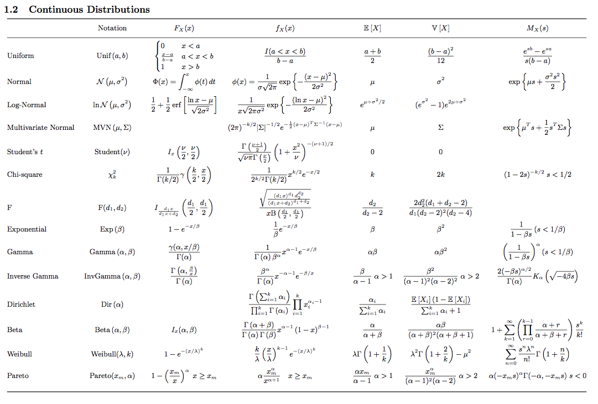

**Update** (*June 5, 2011*):
The probability and statistics cheat sheet now has it's [own
page](http://statistics.zone). Furthermore, I decided to rename
it to *cookbook* because the sheer number of pages [stretches the definition of
*cheat sheet* quite a bit][cook's blog post].

While I started to explore the many univariate probability distribution
relationships last year, I created a PDF to help me remember them. This
document quickly grew into a basic probability theory reference and its
substantial parts evolved while I was taking the excellent course STAT 200B at
[UC Berkeley](http://www.stat.berkeley.edu) taught by [Cari
Kaufman](http://www.stat.berkeley.edu/~cgk). Today, it is more like a cookbook
and helps me to swap back in the relevant context when facing statistical
challenges.

The purpose of this cookbook is to bundle essential statistical knowledge with
a unified notation. If you find any mistakes or have suggestions for further
topics, I'd appreciate if you contact me. I will continue to add material that
I deem useful.

[Download](http://statistics.zone){:.button .radius .expanded .success}

Screenshots
===========

{:.float-center .shaded}
{:.float-center .shaded}

[cook's blog post]: http://www.johndcook.com/blog/2010/10/04/probability-and-statistics-cheat-sheet/
