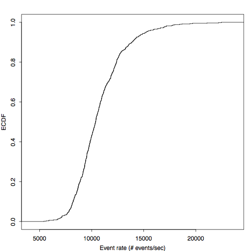
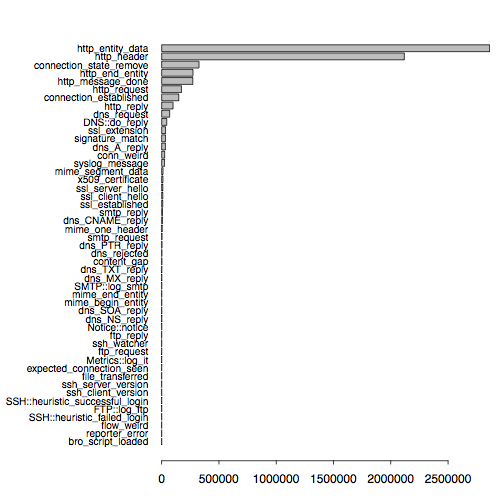

{:.float-right .padding-left-1}
When it comes to understanding your network traffic in terms of volume or
packet rate, the obvious approach is to count packets or add up their size. In
this article, I describe a higher-level alternative to profiling network
traffic based on events generated by the [Bro](http://www.bro-ids.org) network
security monitor. Most of these events represent activity higher up the network
stack, e.g., at the transport and application layer. The difference between
traditional and event profiling is visualized in the Figure on the right.
Conventional tools munge on packets at the network layer; some may also
reassemble transport-layer streams. Bro's event engine additionally generates
protocol-specific events that reflect the applications communication, which
gives the user a much richer description of what's going on in the network.

The size of an event is given by the size of all its arguments (plus a little
bit of meta information, e.g., creation timestamp). How do we get such meta
data though? To date, Bro has limited meta programming support, which makes it
difficult to obtain these details. Thus I added a new *meta event* to Bro,
which the core generates in addition to each regular event. Here is an example
that shows how to handle this event:

```bro
event meta_event(name: string, timestamp: time, size: count)
    {
    print fmt("%s\t%f\%d", name, timestamp, size);
    }
```

You can find a more complete example that writes information about all events
to a separate file `meta.log` in my [brospects][meta.bro] repository. To use
this meta programming functionality, you need to use the topic branch
`topic/matthias/meta-analysis`. A fresh install might look like this:

``` none
git clone --recursive git://git.bro-ids.org/bro.git
git checkout topic/matthias/meta-analysis
./configure --prefix=PREFIX && make && make install
```

To give a real world example of what you can do with this functionality, let us
analyze a trace captured at UC Berkeley (UCB) on October 17, 2011, at 2:35pm
for 10 minutes. At UCB's network border, a Bro cluster of 26 nodes monitors two
10 Gbps links. The full packet trace has a size of 219 GB and contains 284
million packets in 6.5 million connections. When looking at the trace sizes on
the 26 nodes, we observe a median size of 8.1 GB ($$\sigma = 2.2$$) in a range
from 6.3 to 15 GB.

Let us inspect one 7.7 GB trace of a single cluster node in more detail. The
two Figures below show the number of events per second, once over time and once
their empirical distribution.

{:.float-center}
{:.float-center}

In the above Figure, we see median rates of 10,760 ($$\sigma = 2394$$), which
correspond to 13.4 MB/sec. The peak rates is 22,460, or 35 MB/sec. The next
figure shows the distribution of event types. Because most of our traffic at
UCB is HTTP, it is not unsurprising that the HTTP events account for the
largest share.

{:.float-center}

In the future, we hope to add more meta programming and introspection
functionality to Bro. Not only does this help to tune the scripts, but it also
makes it possible to gain new insight into your network that goes beyond
packet-level activity.

[blade00-events]: https://github.com/mavam/brospects/blob/master/bro/meta.bro
[meta.bro]: https://github.com/mavam/brospects/blob/master/bro/meta.bro
